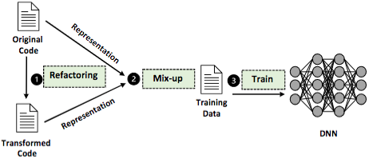

# MixCode: Enhancing Code Classification by Mixup-Based Data Augmentation
Implementaion of SANER2023 paper MixCode: Enhancing Code Classification by Mixup-Based Data Augmentation [[arxiv]](https://arxiv.org/abs/2210.03003).

## Introduction
MIXCODE aims to effectively supplement valid training data without manually collecting or labeling new code, inspired by the recent advance named Mixup in computer vision. Specifically, 1) first utilize multiple code refactoring methods to generate transformed code that holds consistent labels with the original data; 2) adapt the Mixup technique to linearly mix the original code with the transformed code to augment the training data.

<div align=center></div>


## Requirements
On Ubuntu:

- Task: Classification

```shell
Python (>=3.6)
TensorFlow (version 2.3.0) 
Keras (version 2.4.3)
CUDA 10.1
cuDNN (>=7.6)
```

- Task: Bug Detection
```shell
Python (>=3.6)
Pytorch (version 1.6.0) 
CUDA 10.1
cuDNN (>=7.6)
```

## CodeBERT/GraphCodeBERT for Classification Tasks

- pip install torch==1.4.0
- pip install transformers==2.5.0
- pip install filelock

### Fine-Tune 
```shell
cd CodeBERT

python run.py \
    --output_dir=./saved_models \
    --tokenizer_name=microsoft/codebert-base \
    --model_name_or_path=microsoft/codebert-base \
    --do_train \
    --num_train_epochs 50 \
    --block_size 256 \
    --train_batch_size 8 \
    --eval_batch_size 16 \
    --learning_rate 2e-5 \
    --max_grad_norm 1.0 \
    --num_labels 250 \  # Number Classifications
    --seed 123456  2>&1 | tee train.log
```

```shell
cd GraphCodeBERT

python run.py \
    --tokenizer_name=microsoft/graphcodebert-base \
    --model_name_or_path=microsoft/graphcodebert-base \
    --config_name microsoft/graphcodebert-base \
    --do_train \
    --num_train_epochs 50 \
    --code_length 384 \
    --data_flow_length 384 \
    --train_batch_size 8 \
    --eval_batch_size 16 \
    --learning_rate 2e-5 \
    --max_grad_norm 1.0 \
    --evaluate_during_training \
    --num_labels 250 \  # Number Classifications
    --seed 123456  2>&1 | tee train.log
```

## Dataset
- Java250: https://developer.ibm.com/exchanges/data/all/project-codenet/
- Python800: https://developer.ibm.com/exchanges/data/all/project-codenet/
- Refactory: https://github.com/githubhuyang/refactory
- CodRep: https://github.com/KTH/CodRep-competition
